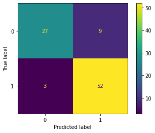

# MachineLearning_Classification_to predict the Heart Disease

### Descriptions
 1) To predict if someone have heart disease or have potential to have heart attack
 2) The datasets contains 303 train dataset with 10 test set
 3) This dataset contains continuous and categorical data
 4) The target is categorical either 0 or 1, less potential to have heart attack, high potential to have heart attack
 5) There are different ML approaches to select the best features in order to have an accurate prediction
 6) For Continuos Data Versus Categorical Data, used : `Logistic Regression`
 7) For Categorical Data Versus Categorical Data, used : `Cramer's V`
 
### Results
`Model`: When tune the model using `Standard Scaler` & `SVC`

`Classification_Report` without fine tune the model

`Confusion_Matrix` without fine tune the model

`Training Data` example for continuous data:

`Training Data` example for categorical data:

### Discussion
1) Machine Learning best pipeline for this dataset is: `Standard Scaler` + `SVC`
2) When tuning the model the accuracy decreases, thus we choose the best model without tuning it
3) The prediction is quite acuurate during deployment
4) For model improvement: Try with different Scalling and Classifier, also different the random_state when train-test-split the data

### Credits
`You can load the dataset from here`
https://www.kaggle.com/rashikrahmanpritom/heart-attack-analysis-prediction-dataset
